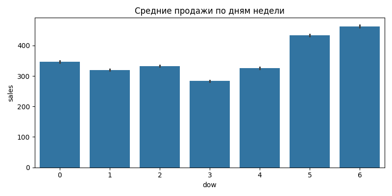
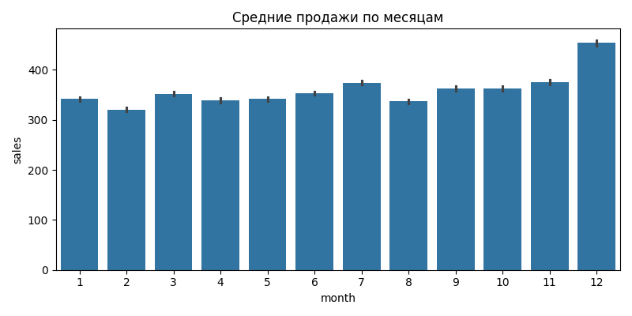
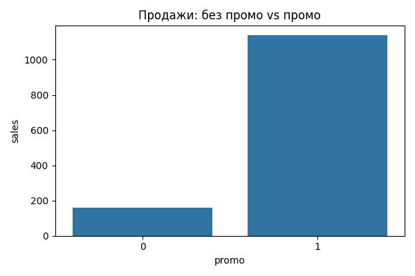
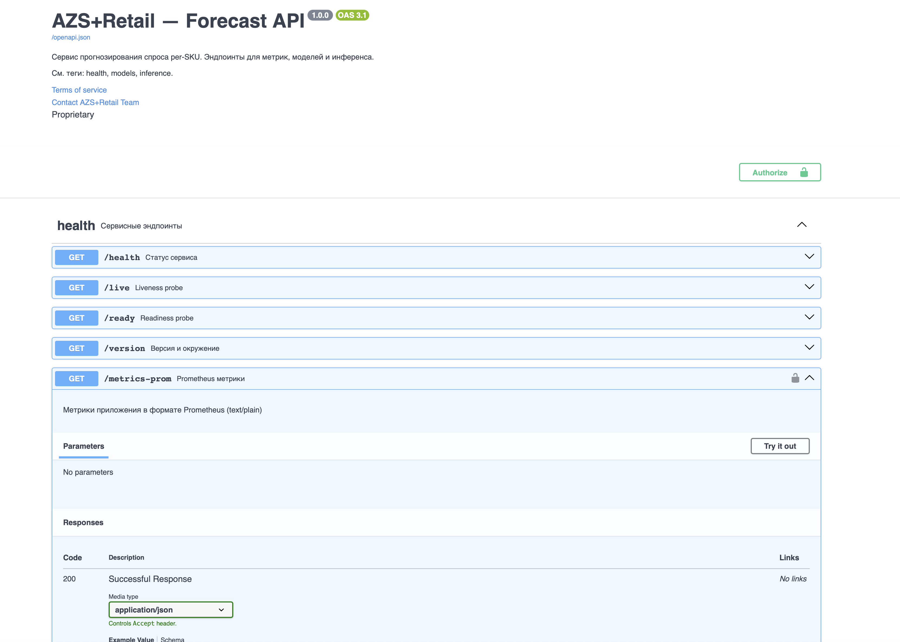

## 1) Постановка задачи и KPI

- Цель: прогноз спроса per‑SKU по (store, family)
- KPI качества: MAE / MAPE / RMSE; покрытие квантилей (P50/P90)
- Бизнес‑метрики: Service Level, Stockout rate, издержки хранения
- Результат: снижение ошибки vs baseline и обоснование экономического эффекта

---

## 2) Данные и источники

- train.csv — продажи (date, store_nbr, family, sales, onpromotion)
- transactions.csv — интенсивность спроса по магазинам
- oil.csv — экзогенный регрессор
- holidays_events.csv — календарные эффекты
- stores.csv — метаданные магазинов (тип/кластер)
- Хранилище: Parquet + DuckDB (data_dw/)

---

## 3) EDA и ключевые инсайты

- Сезонность: по дням недели и месяцам
- Праздники: всплески/провалы спроса
- Промо: значимое влияние на продажи
- Разная дисперсия по магазинам и семействам

---

## 4) Feature Engineering

- Лаги: sales_lag_{1,7,14,28}
- Скользящие: rollmean/rollstd {7,30}
- Промо: onpromotion + лаги/скользящие
- Экзогенные: dcoilwtico, transactions
- Календарь: year, month, day, dow, is_holiday

---

## 5) Модели и валидация

- Baseline: Naive lag‑7, Moving Average(7)
- Основная: per‑SKU LightGBM (l1/tweedie/poisson)
- Альтернативы: Global CatBoost, Global/Per‑SKU XGBoost
- Валидация: time‑series CV, окна 14–28 дней

---

## 6) Тюнинг и интерпретация

- Optuna: подбор num_leaves, learning_rate, n_estimators, max_depth, regularization
- SHAP: summary/top‑features для интерпретации

---

## 7) Результаты (качество)

- MAE/MAPE/RMSE vs baseline (tail 28)
- Прирост: MAE_GAIN_vs_NAIVE, MAE_GAIN_vs_MA(7)
- Квантили: покрытие P50/P90

---

## 8) Business Impact (MAPE → деньги)

- ROP/SS: расчёт per‑SKU (P50/P90 либо эвристика σ)
- Экономика: снижение out‑of‑stock/overstock
- Отчёт: data_dw/business_impact_report.csv

---

## 9) Прод: API + UI + Docker

- API: FastAPI (/docs, X‑API‑Key, health‑пробы, Prometheus)
- UI: Streamlit (лидерборд ошибок, сравнение, прогнозы, ROP/SS)
- Docker Compose: api+ui, healthchecks

Скриншот Swagger: 

---

## 10) Производительность и SOTA‑бонус

- Бенчмарк: latency/память (joblib)
- ONNX + INT8: экспорт и ускорение CPU‑инференса

Пример SHAP: 

---

## 11) Демо (живой сценарий)

- Быстрый прогон: `python scripts/demo_presentation.py --quick`
- Показать: Swagger (/docs), UI (лидерборд, сравнение), ROP/SS
- Сводки: data_dw/summary_metrics.txt, docs/model_comparison.csv

---

## 12) Ограничения и планы

- Данные: шум, неполные промо, холодный старт
- Планы: больше экзогенных факторов; нейронные сети; онлайн‑обучение
